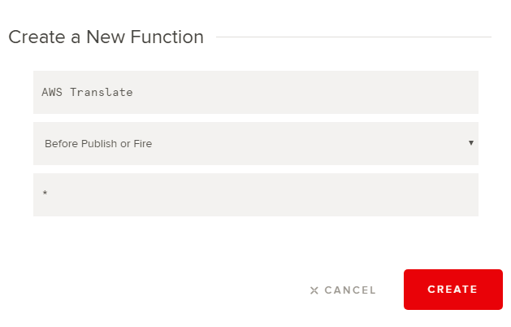

# Multilingual Chat App with PubNub ChatEngine and AWS Translate

Follow this README to build your multilingual chat app with the help of PubNub ChatEngine. ChatEngine is a framework for building chat apps for any chat realted use case. It is feature rich, extensible and designed to work at scale, thanks to the globally available PubNub Data Stream Network. Check out the complete feature list of PubNub ChatEngine.

This repository contains an example chat app built with ChatEngine, that has language translation capabilities. AWS Translate service powers the language translation feature and you will see how easily and quickly you can integrate AWS Translate API in this chat app.  

The source code for this chat app is in Javascript. The UI frontend uses the standard javascript libraries like JQuery, so some level of familiarity with JQuery and standard Javascript language is expected. 

For reference, here is the complete documentation of [PubNub Chatengine](https://www.pubnub.com/products/chatengine/). The AWS Translate documentation can be accessed in [this link](https://aws.amazon.com/documentation/translate/).  

Once built, the app can establish a chat session between two predefined users, John and Peter. It features an on-the-fly language selection dropdown through which the users can choose the language in which they want to receive the messages in. Take a look at this screenshot to get a feel of the language translation feature of the chat app.

  

You can follow the sections below to build this example chat app in no time. But before you begin, you must have an account in PubNub and AWS. 

1. Create your [PubNub developer account](https://admin.pubnub.com)

2. Create your [free AWS account](https://portal.aws.amazon.com/billing/signup#/start) 

  

## [Set Up Basic ChatEngine](#set-up-basic-chatengine)

First you need to setup the ChatEngine enabled PubNub app in your account. 

### Step 1 : Login to your [PubNub App Console](https://admin.pubnub.com)

### Step 2 : Activate ChatEngine in your PubNub account

Follow these steps in [ChatEngine QuickStart Tutorial](https://www.pubnub.com/docs/tutorials/chatengine#step-one-pubnub-keys) to setup your chat app instance. Check the first step "Configure Your Account" in quickstart tutorial and click on the setup button.

### Step 3 : Wait for a few seconds. Once done, you will get a new PubNub app created within your account with a new set of publish and subscribe keys. 

### Step 4 : Check that a new app is created in your PubNub admin dashboard.

Now your app infrastucture is created. For enabling multilingual chat feature, head over to the next section. 

## [Set Up AWS Translate Service](#set-up-aws-translate-service)

Follow these steps to setup your own AWS Translate service

### Step 1 : Setup an IAM user to access AWS Translate service

Follow [these steps](https://docs.aws.amazon.com/translate/latest/dg/setting-up.html) to create an IAM user for AWS Translate. Make sure that the IAM user has full permissions for accessing AWS Translate service.

### Step 2 : Download the IAM user credentials

Download the credentials file for the IAM user and save it. This file contains the AWS ACCESS KEY and AWS SECRET KEY.

## [Set Up PubNub Function for Translation](#set-up-pubnub-function-for-translation)

Follow these steps to setup PubNun Function to serve as the backend for multilingual chat app.

### Step 1 : Setup PubNub Function

Head over to your PubNub dashboard and select the "ChatEngine App" app. Follow the official document of [PubNub Function](https://www.pubnub.com/products/functions/) to create a function for this app by clickign on the "Functions" menu on the sidebar.

### Step 2 : Deploy the function

Use the following parameters for creating the module and function

### Step 3 : Launch the function

Copy the [AWS Translate backend.js] code(function/AWS Transalte backend.js) and paste it in the code window. 

Add your AWS ACCESS KEY and AWS SECREY KEY (Step 2 of "Set Up AWS Translate Service") in the My Secrets vault. 

Now you can launch the function. 

## [App Deployment and Testing](#app-deployment-and-testing)

Follow these steps to setup Translation feature.

### Step 1 : Clone this repository

### Step 2 : Update PubNub keys

### Step 3 : Launch the app instances

Now you can launch both the chat app instances for John and Peter and start chatting. Remember, the translation feature is only enabled for Peter while John can chat only in English. This is becuase AWS Translate currently supports translation to and from English only.

